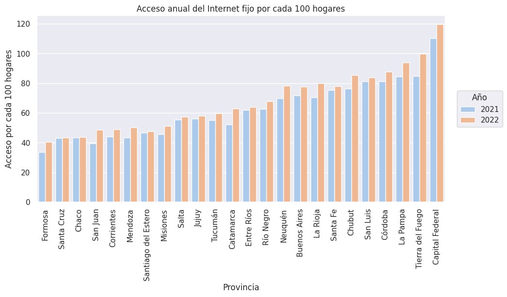
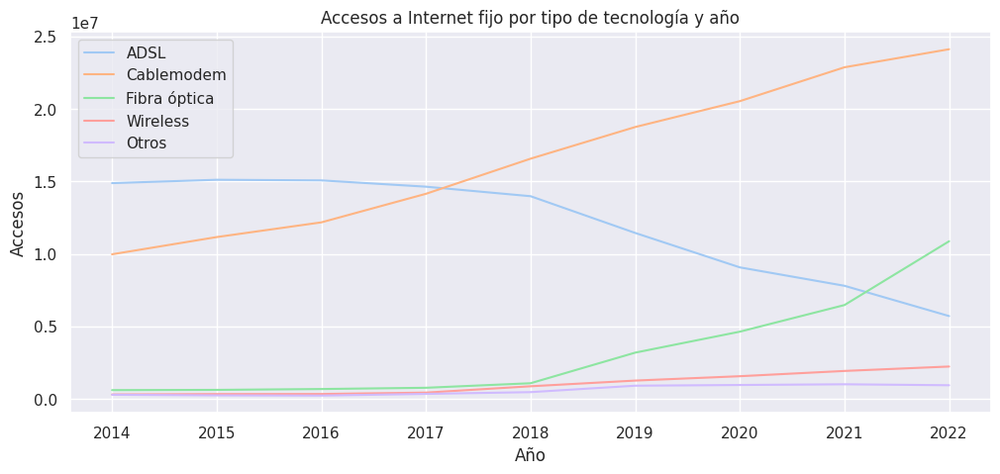
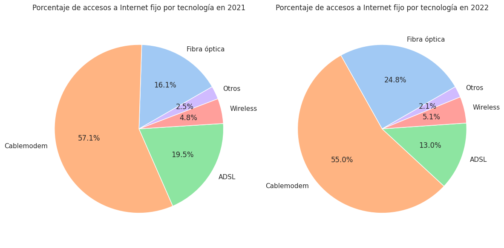
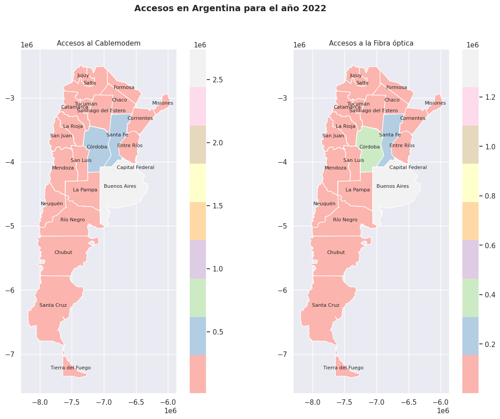
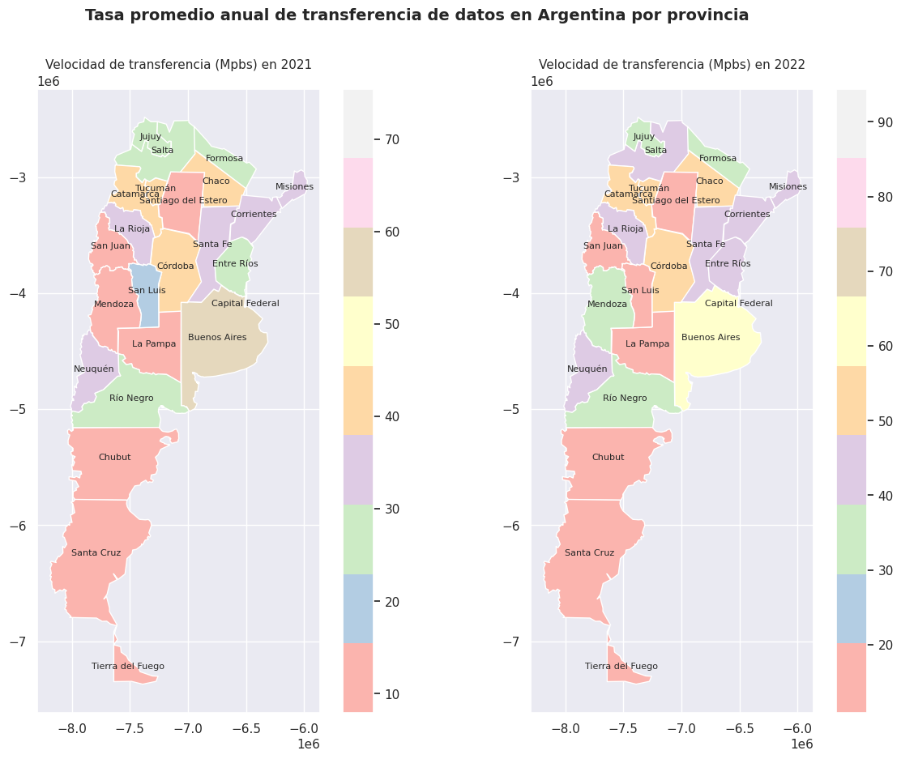
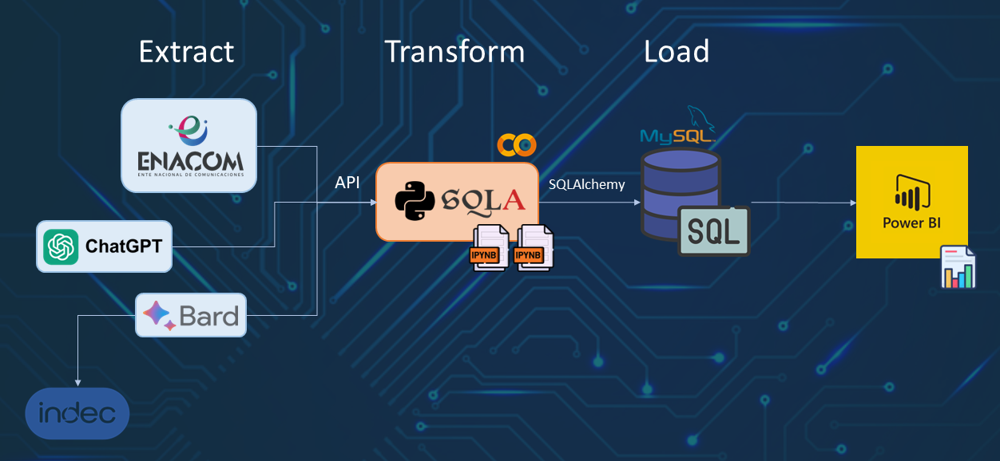

# ```Telecomunicaciones```


## 📡 ```Introducción```

El acceso a Internet se ha convertido en una necesidad básica en la vida cotidiana de las personas. Hoy en día, la mayoría de las actividades diarias, como el trabajo, el estudio, las compras, el entretenimiento y la comunicación, requieren el uso de Internet. Por lo tanto, tener un acceso confiable y de alta calidad es fundamental para las personas y las compañías.

Para las empresas prestadoras de servicios de telecomunicaciones, brindar un servicio de calidad que satisfaga las necesidades de sus clientes es vital para su éxito. Los clientes esperan un acceso rápido y confiable a Internet, sin interrupciones o problemas de conexión. Además, los clientes también buscan servicios personalizados y adaptados a sus necesidades, lo que significa que las empresas deben estar atentas a las tendencias y necesidades del mercado para poder ofrecer soluciones adecuadas.

En este contexto, como parte de mi formación como Data Analytics en la edtech [Henry](https://www.soyhenry.com/), se me asignó la simulación de un proyecto real donde la empresa **K-Sistem Tecnology** me designa la realización de un análisis completo del comportamiento del sector de las telecomunicaciones a nivel nacional en Argentina. Este análisis permitirá reconocer las tendencias y patrones en el comportamiento del mercado, identificar oportunidades de crecimiento y mejorar la calidad de los servicios ofrecidos.

## ✔️ ```Objetivos```

El objetivo principal de este análisis es proporcionar información detallada sobre el desempeño del sector de las telecomunicaciones en Argentina, centrándose principalmente en el acceso a Internet fijo. Algunos objetivos específicos incluyen:

1. Realizar un análisis exhaustivo del comportamiento del sector de las telecomunicaciones a nivel nacional, con el fin de identificar tendencias y patrones en el mercado.

2. Identificar los indicadores clave de rendimiento (KPIs) más relevantes para evaluar el éxito de los objetivos de la empresa K-system Technology, teniendo en cuenta las tendencias y patrones identificados en el análisis del mercado.

3. Proponer a la empresa K-system Technology tres KPIs específicos que sean relevantes para medir el éxito de sus objetivos.

4. Ingestar los datos procesados en un motor SQL para utilizarlos como fuente de información en los Dashboards de Power BI, presentados a la empresa.

## 🔍 📊 ```Desarrollo del Proyecto```

Para lograr estos objetivos, se utilizaron los datasets proporcionados por [ENACOM](https://datosabiertos.enacom.gob.ar/dashboards/20000/acceso-a-internet/), incluyendo la penetración de Internet fijo por hogares a nivel nacional, el total nacional de accesos a Internet fijo por banda ancha y banda angosta, el acceso a Internet fijo por tecnología y provincia, la velocidad media de bajada de Internet fijo por provincia y los accesos a Internet fijo por velocidad de bajada y provincia.

En primera instancia el análisis se llevó a cabo a través de un notebook utilizando herramientas de análisis estadístico y visualización de datos para realizar un análisis exploratorio de cada uno de los datasets destacando los siguientes puntos:

### 🔼 Penetración de Internet fijo

Los resultados del análisis mostraron que **la penetración de Internet fijo** varío significativamente entre las diferentes provincias de Argentina. Por ejemplo, algunas provincias tienen una penetración de más del 60%, mientras que otras apenas alcanzan el 40%. Esto indica que hay oportunidades de crecimiento en aquellas provincias donde la penetración es baja. Por lo que la empresa podría enfocar sus esfuerzos en estas provincias para aumentar su participación en el mercado y brindarle el acceso a Internet a un mayor número de personas.



### 🔼 Accesos a Internet fijo por tipo de tecnología



En Argentina hay una tendencia hacia el uso de tecnologías de acceso a Internet fijo de alta velocidad como la **Fibra Óptica** y el **Cablemodem**; mientras que por un lado el ADSL está disminuyendo en términos de cantidad de accesos, por otro lado la tecnología inalámbrica (Wireless) ha mantenido un nivel constante de accesos a lo largo de los años, lo que sugiere que su uso se ha mantenido estable.

La Fibra Óptica ha experimentado un importante crecimiento en los últimos años pasando de 604 mil accesos en 2014 a 10.87 millones en 2022, lo que sugiere una transición hacia tecnologías de acceso a Internet de mayor capacidad y velocidad. Se espera que esta tendencia continúe debido a los beneficios que ofrece la Fibra Óptica en términos de velocidad, capacidad y estabilidad de conexión en comparación con otras tecnologías.



Por otro lado, los datos muestran que la Fibra Óptica y el Cablemodem representan más del 75% del total de accesos a Internet fijo en Argentina para el año 2022.

Es importante destacar que la cantidad de accesos en Buenos Aires y la Capital Federal sesga el análisis sobre la tecnología más empleada a nivel nacional. Como se puede apreciar en los siguientes mapas correspondientes al año 2022



En efecto, la mayoría de los accesos totales para el Cablemodem y Fibra Óptica en 2022 corresponden a estas dos áreas, lo que representa más del 60% del total de accesos para cada una de estas tecnologías en el país. La preferencia o accesibilidad de estás tecnologías no es uniforme en todo el territorio nacional.

Sin embargo, la limitada presencia de la tecnología de Fibra Óptica en la mayoría de las provincias de Argentina podría representar una oportunidad para el desarrollo de la empresa en estas regiones. En este sentido, **K-System Technology** podría enfocarse en aquellas provincias con una alta demanda y una gran necesidad de servicios de Internet, pero que no cuentan con la cobertura de ningún proveedor actualmente.

### 🔼 Velocidad media de descarga de Internet fijo

La velocidad media de descarga de Internet fijo varía entre las diferentes provincias de Argentina. Mientras que algunas provincias tienen una velocidad media de descarga de más de 30 Mbps, otras apenas alcanzan los 10 Mbps. Esto indica que hay oportunidades para mejorar la calidad del servicio de Internet fijo en algunas áreas. La empresa **K-System Tecnology** podría enfocar sus esfuerzos en aquellas provincias donde la velocidad media de descarga es más baja para mejorar la calidad de su servicio y satisfacer mejor las necesidades de sus clientes.



## 💡```KPIs sugeridos```

Por otra parte a la empresa se le sugieren los siguientes KPIs:

- **KPI1 (Penetración de Internet fijo)**
  
  Este KPI permite evaluar la adopción del servicio de Internet fijo a nivel nacional y comparar el crecimiento a lo largo del tiempo. Un aumento en la penetración indica una mayor demanda y oportunidades de crecimiento en el mercado.
  - **Métrica**: Porcentaje de aumento en la adopción del servicio de Internet fijo en un período determinado (por ejemplo, trimestral o anual).
  - **Objetivo**: Aumentar la penetración de Internet en un 5% respecto al año anterior.

- **KPI2 (Penetración de Fibra Óptica al Final del Año)**

  Las tecnologías más modernas, como la fibra óptica, ofrecen mayores velocidades y mayor capacidad de transmisión de datos. Migrar a tecnologías más avanzadas mejora la calidad del servicio, permite ofrecer mayores velocidades de conexión y brinda ventajas competitivas en el mercado.
  - **Métrica**: Porcentaje de migración a tecnologías modernas, como la fibra óptica, en un período determinado.
  - **Objetivo**: Lograr que el 20% de los accesos de Internet fijo estén basados en fibra óptica para finales del año.

- **KPI3 (Velocidad promedio de descarga en provincias con baja calidad de servicio)**
  
  Este KPI proporciona información sobre la calidad del servicio de Internet fijo en diferentes provincias. La empresa podría utilizar este KPI para identificar áreas donde la calidad del servicio de Internet fijo es más baja y trabajar para mejorarla
  - **Métrica**: Velocidad promedio de descarga en megabits por segundo (Mbps) en las provincias donde la velocidad promedio es inferior a 30 Mbps
  - **Objetivo**: Aumentar la velocidad promedio de descarga en estas provincias a 25 Mbps en el transcurso del año.

## 🛢️ ```Base de Datos```

Se creó una base de datos analítica a fin de conectarla a Power BI para brindar la capacidad de realizar análisis en profundidad, generar visualizaciones dinámicas y obtener insights valiosos a partir de los datos almacenados.



##  🗺️ ```Dashboard```

Por último se presenta un dashboard en PowerBI con el objetivo de resumir y presentar la información de manera clara y concisa a la empresa así como mencionar los insights obtenidos a partir del análisis, los cuales permitirán a **K-System Technology** mejorar la calidad del servicio y a impulsar un crecimiento sostenible en el futuro.


## 🛠️ ```Tecnologías y Herramientas utilizadas```

- **Python**: lenguaje de programación principal utilizado en el proyecto.

    

- **Librerías de Python**: se utilizaron diversas librerías de Python para diferentes tareas en el proyecto como Pandas, Numpy, Matplotlib, Seaborn y Geopandas, SQLAlchemy

- **Google Colab**: plataforma de Jupyter Notebook basada en la nube que se utilizó para el EDA (Análisis Exploratorio de datos)

    

- **MySQL**:  es un sistema de gestión de bases de datos relacional donde se alojó la data para que fuera consumida por PowerBI.

    

- **PowerBI**: es una plataforma de análisis de datos y visualización de Microsoft, la cual se utilizó para la realización del dashboard

    

## 🌐```Referencias```

- Datasets obtenidos de [ENACOM](https://datosabiertos.enacom.gob.ar/dashboards/20000/acceso-a-internet/)

- El archivo geojson del mapa de Argentina proviene de [Kaggle](https://www.kaggle.com/datasets/pablomgomez21/geojson-file-provincias-argentinas)

- El archivo ```geo_argentina.csv``` con la latitud y longitud de cada provincia, fue generado por la **IA ChatGPT**

- Los datos respecto a la población por provincias de Argentina para el año 2022 y los relacionados a la población total de Argentina desde el 2014 hasta el 2022, fueron generados por la **IA Bard**. La información proviene del Instituto Nacional de Estadística y Censos ([INDEC](https://www.indec.gob.ar/)).
  
## 👩‍💻 ```Data Scientist```

Si deseas contactarme, simplemente haz clic sobre mi nombre y serás redirigido a mi perfil de LinkedIn. Estaré encantada 🤗 de responder a tus consultas y compartir más detalles sobre mis habilidades y experiencia.

<div align="center">

[<br><sub>Danniela Rodríguez</sub>](https://www.linkedin.com/in/danniela-rodriguez-jove-/)

<div align="left">

## 🙌 ```Agradecimiento y Actualizaciones```

_¡Gracias por revisar este proyecto_ 🤗! _Si deseas estar al tanto de futuras actualizaciones, te invito a marcar el repositorio con un estrella_ ⭐. _Puedes encontrar la opción para hacerlo en la parte superior derecha de la página. Tu apoyo es muy apreciado._
